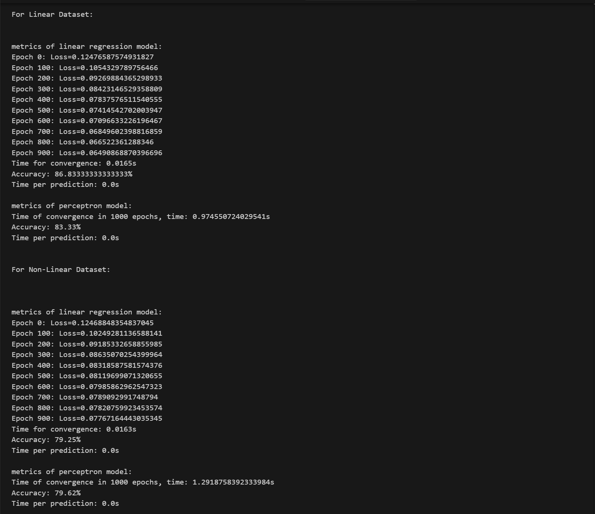

# Model Analysis

this report analyzes linear regression and perceptron models on two datasets(linear and non-linear separable datasets)

## Metrics Recorded

Here are the logged metrics for both the models on these datasets

| **Dataset** | **Model** | **Accuracy** | **Convergence Time** | **Time per Prediction** |
|:---|:---|:---:|:---:|:---:|
| `binary_classification.csv` (Linear) | Linear Regression | 86.83% | 0.0165s | ~0.0s |
| `binary_classification.csv` (Linear) | Perceptron | 83.33% | 0.9746s | ~0.0s |
| `binary_classification_non_lin.csv` (Non-Linear) | Linear Regression | 79.25% | 0.0163s | ~0.0s |
| `binary_classification_non_lin.csv` (Non-Linear) | Perceptron | 79.62% | 1.2919s | ~0.0s |

---

## Analysis

**In case of linear dataset:**
Linear Regression model had **more** accuracy and **less** convergence time when compared with perceptron model.

**In case of non-linear dataset:**
Linear Regression model has **less** accuracy and **less** convergence time when compared with perceptron model.

- perceptron model ahs more convergence time when compared to linear regression model as it kinda "bounces around" a bit before settling, while the linear regression model finds the best countinuous boundary

- Hence, resulting in more convergence time for perceptron model and more accuracy

Credits to claude the goat for teaching me about these models and how to implement them in python.

- *By Ramcharan(ThatSlurp) :D*
